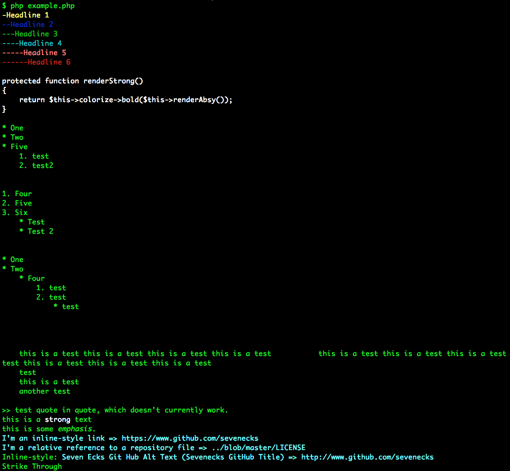

# Markdown-Terminal

This project is an extension of [Markdown](https://github.com/cebe/markdown) that adds the ability to convert markdown to terminal output instead of HTML.

You can use the setConfig function to set various config options for colorizing the output.

## Installation

Via Composer

```bash
composer require sevenecks/markdown-terminal
```
## Example Usage

```php
<?php
// you must run this from the /example directory
//
require '../vendor/autoload.php';

$markdown = <<<EOT
# Headline 1
## Headline 2
### Headline 3
#### Headline 4
##### Headline 5
###### Headline 6

\```
protected function renderStrong($block)
{
    return \$this->colorize->bold(\$this->renderAbsy($block[1]));
}
\```

* One
* Two
* Five
    1. test
    2. test2

1. Four
2. Five
3. Six
    * Test
    * Test 2
    
* One
* Two
    * Four
        1. test
        2. test
            * test

> this is a test this is a test this is a test this is a test           this is a test this is a test this is a test this is a test this is a test this is a test this is a test this is a test this is a test this is a test this is a test 
> test
> this is a test
> another test

>> test quote in quote, which doesn't currently work.

this is a **strong** text

this is some _emphasis_.

[I'm an inline-style link](https://www.github.com/sevenecks)

[I'm a relative reference to a repository file](../blob/master/LICENSE)

Inline-style: [Seven Ecks Git Hub Alt Text](http://www.github.com/sevenecks "Sevenecks GitHub Title")

[another example]: https://github.com/sevenecks "another example"

~~Strike Through~~

EOT;
$parser = new SevenEcks\Markdown\MarkdownTerminal;
echo $parser->parse($markdown);
```



## Change Log
Please see [Change Log](CHANGELOG.md) for more information.

## License

The MIT License (MIT). Please see [License File](LICENSE.md) for more information.
